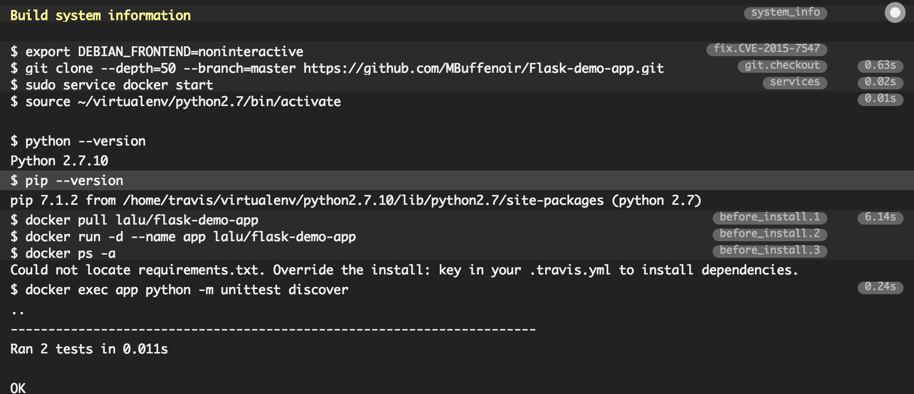

# Introduction

This tutorial is part of a series on how to create CI/CD pipelines for your web applications using Docker containers. It is following up the first part focused on [how to use Docker Hub to automatically build your applications images](https://www.linux.com/learn/integrating-docker-hub-your-application-build-process).

Application testing is key for a properly functionning web application. There are many ways to test your application, but we will focus here on the essential unit tests and see how we can integrates Docker in the process.

## Requirements

You will not need more software installed on your workstation than what you already used during the first part.

I will follow the spirit of the other tutorials I wrote and keep using plateforms, like Docker, that offers free plans for public projects.

Please register an account on the [Travis](https://travis-ci.org/) testing platform, preferably using your github account so that your repository can be automatically linked into your Travis account.

## Create and run unit tests locally with docker.

In your app folder, create a file called `test_app.py` containing the following test code for your application:

```
from app import app
import unittest

class FlaskAppTests(unittest.TestCase):

    @classmethod
    def setUpClass(cls):
        pass

    @classmethod
    def tearDownClass(cls):
        pass

    def setUp(self):
        # creates a test client
        self.app = app.test_client()
        # propagate the exceptions to the test client
        self.app.testing = True

    def tearDown(self):
        pass

    def test_home_status_code(self):
        # sends HTTP GET request to the application
        # on the specified path
        result = self.app.get('/')

        # assert the status code of the response
        self.assertEqual(result.status_code, 200)

    def test_home_data(self):
        # sends HTTP GET request to the application
        # on the specified path
        result = self.app.get('/')

        # assert the response data
        self.assertEqual(result.data, "Hi ! I\'m a Flask application.")
```

Add the code to your repo with:

    git add test_app.py
    git commit -m "First commit test file" test_app.py
    git push

Wait for your image to be build on the Hub or build it locally and run it with:

    docker pull lalu/flask-demo-app
    docker run -d --name app -p 80:80 lalu/flask-demo-app

Run your newly created unit tests with:

    docker exec app python -m unittest discover

You should see the positive results of your testing:

```    
----------------------------------------------------------------------
Ran 2 tests in 0.009s

OK
```

You've just ran your first tests locally and successfully! Let's see how you can have this task runned automatically for you everytime a new commit is done to your code repository.

## Using travis continuous integration plateform to perform test automatically

In the second part of the tutorial you are going to use the SaaS version of travis-ci, one of the most popular continuous integration platform out there. Of course what you are going to do would apply perfectly to your own installtation of Travis-ci.

Login to [Travis-ci](http://travis-ci.org) with your github account and switch the build of your project on, in my case:


Configuring Travis, requires nothing more than a simple file in your repository. This file will contains the differents instructions to have Travis-ci run your unit tests.

Create a file named `.travis.yml` with the following content:

```
sudo: required

language: python

services:
  - docker

before_install:
- docker build -t flask-demo-app .
- docker run -d --name app flask-demo-app
- docker ps -a

script:
- docker exec app python -m unittest discover

after_script:
- docker rm -f app
```

The process is pretty straighforward and mimics what you've done locally just before. Travis will be first building your image, then runnning it and finally executing a command inside the container to run the tests.

Now simple add your file to your repository:

    git add .travis.yml
    git commit -m "Initial commit of travis test instructions" .travis.yml
    git push

By default Travis will run your tests each time a new commit or a pull request is done to your repository.
As you've just done this by adding our .travis.yml, your project should already be building. 

Click on the little wheel next to your project name to see your build details. You should see here the result of the latest build:



Et voila ! Now you simply have to keep up with providing well tested code to your project, Travis will automatically run those tests for you.

It is easy to add the state of the latest build to your app Readme.md using the code ``

Check out mine [here](https://github.com/MBuffenoir/Flask-demo-app) !

# Conclusion

To go further, have a look at Travis-ci [documentation](https://docs.travis-ci.com/). For example, it is easy to add notifications about the state of the latest build. Connectors exists for mail, chat applications, etc ...

Next time, we are going to have a look on how to use Travis and docker-compose to deploy your application !

